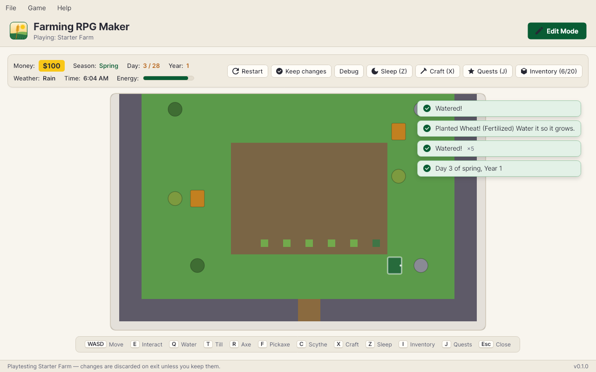
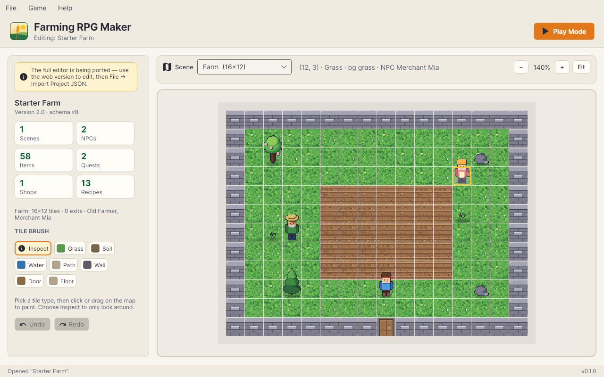
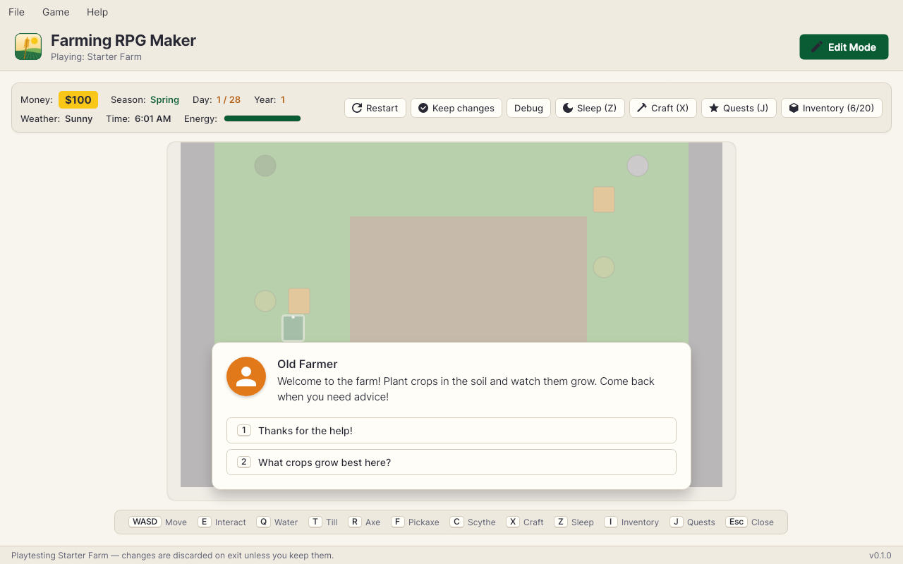
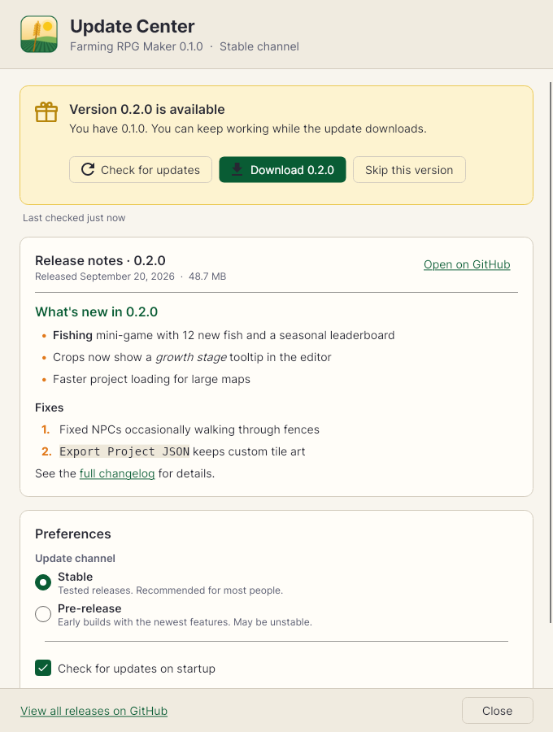

# Farming RPG Maker — native Windows app

A native desktop rewrite of [Farming RPG Maker](https://github.com/jxburros/farm-game-engine),
a 2D farming-RPG game engine and maker. It is written in C# on .NET 10, with
[Avalonia](https://avaloniaui.net) for the UI and Skia for drawing, so there
is no browser or web view inside. It updates itself from GitHub Releases
through the built-in **Update Center**.

| Play Mode | Edit Mode |
|---|---|
|  |  |

| Dialogue | Update Center |
|---|---|
|  |  |

## Status

The simulation engine, sample games, runtime and Play Mode are ported. The
visual editor is being ported next. Until then, build games in the
[web version](https://github.com/jxburros/farm-game-engine) and bring them in
with **File → Import Project JSON**. Projects move freely between the two
(same JSON format, schema v8). See [ROADMAP.md](ROADMAP.md).

**Same engine, proven.** The web version's TypeScript engine is the reference.
[`tools/golden`](tools/golden) records play sessions from it, and the C# tests
replay them and require every state hash to match byte for byte. The recorded
sessions cover farming, weather, NPC schedules, events, shops, crafting, mines,
fishing, content packs and plugins, 23 in all. Same seed + same inputs ⇒ the
same game on both.

## Install

Download `FarmingRpgMaker-win-Setup.exe` from the
[latest release](https://github.com/jxburros/farm-game-engine-native/releases/latest)
and run it. It installs per-user and needs no admin rights. A portable zip is
attached to the release too.

Builds are not code-signed yet, so Windows SmartScreen may say *"Windows
protected your PC"*. Choose **More info → Run anyway**.

### Updates

**Help → Update Center** checks GitHub Releases for newer versions. It shows
the release notes, downloads the update in the background, and applies it
with **Restart & install**. Other options:

- **Stable** or **Pre-release** channel
- **Check for updates on startup** (on by default)
- **Download updates automatically** (off by default)
- **Skip this version**

## Controls (Play Mode)

| Keys | Action |
|---|---|
| WASD / arrows | Move (diagonals included) |
| E / Space / Enter | Interact (talk, harvest, plant, use) |
| Q · T · R · F · C | Watering can · Hoe · Axe · Pickaxe · Scythe |
| Z | Sleep |
| I · J · X | Inventory · Quests · Crafting |
| 1–9 | Pick a dialogue option |
| Esc | Close panel / dialogue / shop |
| F5 / F6 | Play / Edit mode |
| Ctrl+Z / Ctrl+Y | Undo / redo (Edit Mode) |

Projects are saved in `%APPDATA%\FarmingRpgMaker\projects\`.

## Build from source

You need the [.NET 10 SDK](https://dotnet.microsoft.com/download).

```sh
dotnet build FarmingRpgMaker.sln
dotnet test FarmingRpgMaker.sln
dotnet run --project src/FarmingRpgMaker.App
```

Everything builds and tests on Windows, macOS and Linux. The
[CI workflow](.github/workflows/ci.yml) also publishes a self-contained
`win-x64` build on every push.

### Projects

| Project | What it is | Ported from (web repo) |
|---|---|---|
| `FarmEngine.Schemas` | Data shapes, JSON, migrations, JS-semantics helpers | `packages/engine-schemas` |
| `FarmEngine.Core` | Deterministic simulation (commands, ticks, all game systems) | `packages/engine-core` |
| `FarmEngine.Content` | Default content pack, sample games, templates | `packages/content-default`, `src/lib/templates.ts` |
| `FarmEngine.Runtime` | Fixed timestep, input, minigames, panels, audio, Jint plugin sandbox | `packages/engine-runtime` |
| `FarmEngine.Rendering` | Skia world renderer, snapshots, camera | `packages/renderer-canvas2d`, `packages/game-shell/src/snapshot.ts` |
| `FarmingRpgMaker.Updates` | Update Center backend (Velopack + GitHub Releases) | — |
| `FarmingRpgMaker.App` | Avalonia desktop app | `src/` (React app) |

[docs/PORTING.md](docs/PORTING.md) has the porting conventions.
[docs/LANGUAGES.md](docs/LANGUAGES.md) is the plan to move the engine to Rust
and the project logic to F#, with C# keeping the desktop app.
[docs/EXPORT.md](docs/EXPORT.md) covers Export Game: standalone Windows and
Linux games built on the native player.

## Releasing

Push a version tag (`v0.2.0`, or `v0.3.0-beta.1` for a pre-release). The
[release workflow](.github/workflows/release.yml) then:

1. builds, tests and packages the app with Velopack;
2. publishes the installer, portable zip and delta-update packages as a
   GitHub Release.

Installed apps find the release in their Update Center. See
[docs/RELEASING.md](docs/RELEASING.md).
