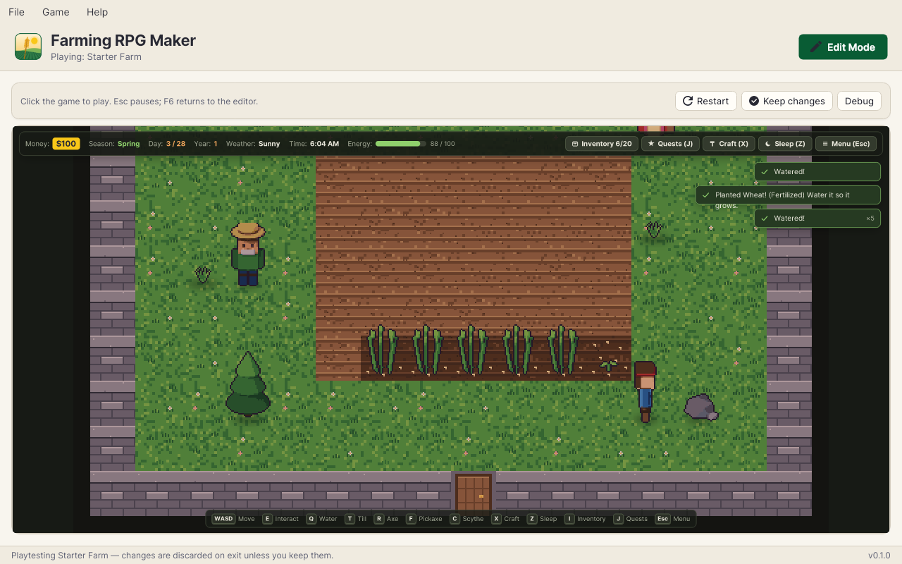
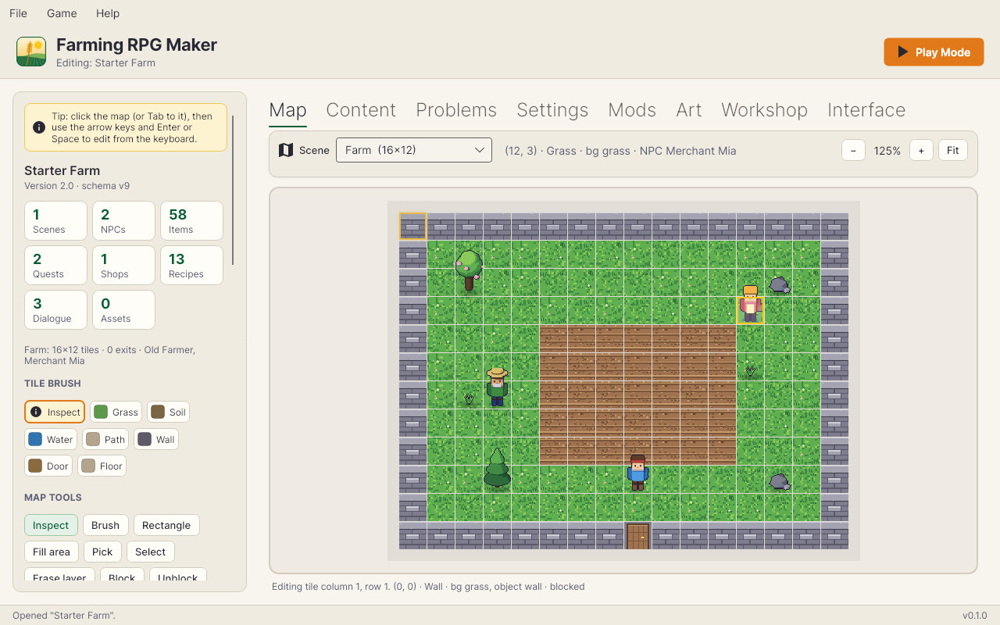
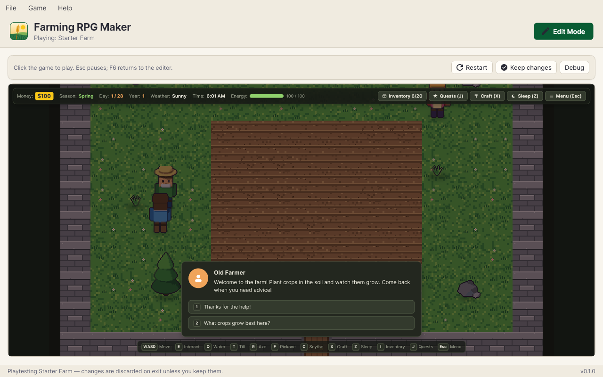
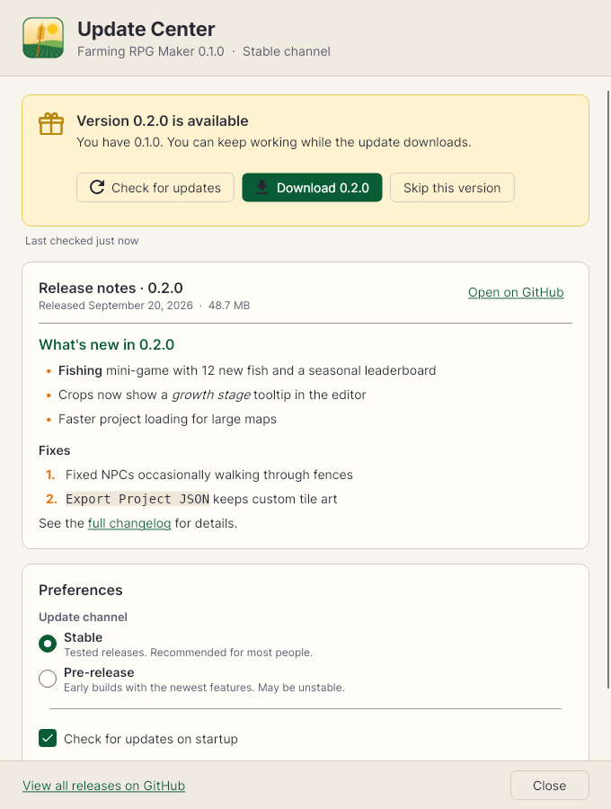

# Farming RPG Maker — native Windows app

A native desktop rewrite of Farming RPG Maker, a 2D farming-RPG game engine
and maker that started as a web app (`jxburros/farm-game-engine`, a private
repository). The game engine, renderer, in-game UI and player are Rust;
project edits, validation, the content compiler and Export Game are F#; the
editor's desktop UI is C# on .NET 10 with [Avalonia](https://avaloniaui.net).
There is no browser or web view inside. The app updates itself from GitHub
Releases through the built-in **Update Center**.

| Play Mode | Edit Mode |
|---|---|
|  |  |

| Dialogue | Update Center |
|---|---|
|  |  |

## Status

The port of the web version is complete. The simulation, runtime, renderer,
in-game UI, plugin sandbox and game player run in Rust; the editor keeps its
Avalonia UI and does its project work in F#. Edit Mode includes map painting
and scene tools (by mouse or keyboard, with screen-reader support), content
forms with nested editors, reference pickers, profit readouts and thumbnails,
project and export settings, Problems, mods, an art and animation studio
(raster and SVG), creator patterns and interface panels. Everything the web
editor did is ported (see [ROADMAP.md](ROADMAP.md#parity-with-the-web-editor)). Projects move between the native and
web version through the same
project JSON format (schema v9), and both apps now run one engine: the web
editor plays through `farm-wasm` and loads, checks and compiles projects with
this repository's F# core compiled to JavaScript. See [ROADMAP.md](ROADMAP.md).

**One player, in the editor and in exported games.** Play Mode embeds the Rust
game player (`crates/farm-player` with `crates/farm-ui`) through the C ABI:
the world, HUD, dialogue, shops, crafting, inventory, quests, minigames and
toasts look and behave exactly as they do in an exported game. Frames run on a
worker thread, so plugins never stall the editor. The editor adds Restart,
Keep changes and a debug drawer. Content-pack plugins run in `farm-plugins`, a
QuickJS-in-WebAssembly sandbox with deterministic fuel budgets; a pack's
manifest declares what its plugins may change ([docs/PLUGINS.md](docs/PLUGINS.md)).

**F# authoring.** Project migrations, validation, the Problems pipeline,
content compilation, pack composition, localization, the starter pack and the
New Project templates are F#, and so are the schema records every editor view
binds to. `farmc` compiles a project into a deterministic cartridge and exports
standalone games. The authoring core compiles to JavaScript with
[Fable](https://fable.io) for the web version (`tools/fable`).

Building from source needs a Rust toolchain as well as .NET: `dotnet build`
builds the Rust library and the player templates too.

**Looks like a game out of the box.** Sample games ship with a built-in
pixel-art pack (tiles, crops, trees, machines, animals, walking characters)
plus day/night, seasons and weather, with zero project changes; any art a
creator binds still wins. The pack is generated by
[`tools/art`](tools/art) (Blender + Pillow, checked in as PNG sheets and a
JSON manifest).

**Same engine, proven.** The Rust core was ported against the web version's
TypeScript engine: [`tools/golden`](tools/golden) recorded play sessions from
it (farming, weather, NPC schedules, events, shops, crafting, mines, fishing,
content packs and plugins), and the Rust tests replay them and require every
state hash to match byte for byte. Now that the web editor runs this engine
too, Rust is the reference: since the move to integer numerics (schema v9,
[docs/NUMERICS.md](docs/NUMERICS.md)) the goldens are recorded from it, and the
TypeScript ones stay as migration inputs. Same seed
+ same inputs ⇒ the same game, on the desktop, in exported games and in the
browser.

## Install

Download `FarmingRpgMaker-win-Setup.exe` from the
[latest release](https://github.com/jxburros/farm-game-engine-native/releases/latest)
and run it. It installs per-user and needs no admin rights. A portable zip is
attached to the release too.

Builds are not code-signed yet, so Windows SmartScreen may say *"Windows
protected your PC"*. Choose **More info → Run anyway**.

### Updates

**Help → Update Center** checks GitHub Releases for newer versions. It shows
the release notes, downloads the update in the background, and applies it
with **Restart & install**. Other options:

- **Stable** or **Pre-release** channel
- **Check for updates on startup** (on by default)
- **Download updates automatically** (off by default)
- **Skip this version**

## Controls (Play Mode)

| Keys | Action |
|---|---|
| WASD / arrows | Move (diagonals included) |
| E / Space / Enter | Interact (talk, harvest, plant, use) |
| Q · T · R · F · C | Watering can · Hoe · Axe · Pickaxe · Scythe |
| Z | Sleep |
| I · J · X | Inventory · Quests · Crafting |
| 1–9 | Pick a dialogue option |
| Esc | Close panel / dialogue / shop, else the pause menu |
| F5 / F6 | Play / Edit mode |
| Ctrl+Z / Ctrl+Y | Undo / redo (Edit Mode) |

In Edit Mode, choose a tile type and map tool in the side panel. Drag with
Brush, Erase, Block or Unblock; drag with Rectangle or Select to define an
area. Copy a selection, then choose **Paste on map** and click its destination.
The scene controls create, rename, resize and duplicate maps, and can fill a
whole scene or clear its crops and items. To make a door,
choose **Door**, click its departure tile, choose a destination and save it;
**Return door** creates the reverse link in the same undo step.

Projects are saved in `%APPDATA%\FarmingRpgMaker\projects\`.

## Export Game

**File → Export Game…** turns the open project into standalone games for
Windows x64 and Linux x64 (including Steam Deck), and into a **Web (browser
demo)** page for itch.io. Pick the targets and an output folder, and export
writes one folder per target and, if you like, a `.zip` or `.tar.gz`:

```text
WillowCreek-windows-x64.zip   WillowCreek/WillowCreek.exe, game.cart, licenses/
WillowCreek-linux-x64.tar.gz  WillowCreek/WillowCreek, game.cart, .png, .desktop, licenses/
WillowCreek-web.zip           index.html, game.js, farm_wasm_bg.wasm, game.cart, licenses/
```

The web demo runs the same Rust player compiled to WebAssembly, with touch
controls on phones and tablets; test it from a web server (for example
`python3 -m http.server` in its folder).

The Windows `.exe` gets the game's icon and version info. Problems errors
stop the export; warnings are listed in the report. Export needs no compiler:
it uses the player templates that ship with the app. The same export runs
from the command line, for example in CI:

```sh
dotnet run --project src/FarmEngine.Cli -- export my-game.json --target windows-x64 --target linux-x64 --out dist
```

Exported games open a window with a title screen, save slots, a pause menu,
settings and gamepad support. See [docs/EXPORT.md](docs/EXPORT.md) and
[docs/PLAYER.md](docs/PLAYER.md).

## Build from source

You need the [.NET 10 SDK](https://dotnet.microsoft.com/download) and a
[Rust toolchain](https://rustup.rs) (the version is pinned in
`rust-toolchain.toml`). `dotnet build` also builds the Rust library.

```sh
dotnet build FarmingRpgMaker.sln
dotnet test FarmingRpgMaker.sln
dotnet run --project src/FarmingRpgMaker.App
cargo test --workspace   # Rust engine tests, including the golden replays
```

The F# command-line compiler turns a validated project into a cartridge for
the Rust player:

```sh
dotnet run --project src/FarmEngine.Cli -- compile my-project.json --out game.cart
```

The Rust `farm-player` plays a cartridge in a window, runs a headless replay
for validation, or renders screenshots; see [docs/PLAYER.md](docs/PLAYER.md).

```sh
cargo run -p farm-player -- --cart game.cart
```

The build also puts a player template for your platform (Windows or Linux
x64) in `players/` next to the app and `farmc`, so Export Game works from a
source build. Export tests need no extra tools; rebuilding the PE test
fixture needs mingw-w64 (see `tests/FarmEngine.Export.Tests/Fixtures/pe/build.sh`).

Everything builds and tests on Windows, macOS and Linux. The
[CI workflow](.github/workflows/ci.yml) also publishes a self-contained
`win-x64` build on every push.

### Projects

| Project | What it is | Ported from (web repo) |
|---|---|---|
| `FarmingRpgMaker.Updates` | Update Center backend (Velopack + GitHub Releases) | — |
| `FarmingRpgMaker.App` | Avalonia desktop app: Edit Mode, Play Mode host, Export Game dialog | `src/` (React app) |
| `FarmEngine.Interop` | P/Invoke bindings to the Rust library (`RustPlayer`, `RustPreview`, `RustSession`) | — |
| `FarmEngine.Authoring` (F#) | The schema records and their JSON, project edits, undo/redo, migrations, validation, Problems, content compiler, packs, sample templates, cartridge compiler and reader; compiles to JavaScript with Fable (`WebApi.fs`) | `src/components/*` decisions, `packages/engine-schemas`, `packages/content-default`, `src/lib/templates.ts` |
| `FarmEngine.Authoring.Net` (F#) | The .NET edge of the F# core: `System.Text.Json` conversion, `RecordJson` and the generated `RecordWith` extensions the C# app builds records with | — |
| `FarmEngine.Export` (F#) | Export Game: player templates, Windows icon/version patching, folders and archives | — |
| `FarmEngine.Cli` (F#) | `farmc compile` and `farmc export` | — |
| `crates/farm-sim` (Rust) | Deterministic simulation, golden-verified | `packages/engine-core` |
| `crates/farm-host` (Rust) | The host protocol shared by `farm-ffi` and `farm-wasm`: player, session and preview requests and responses | — |
| `crates/farm-ffi` (Rust) | C ABI the app loads: the embedded player, map previews, headless sessions | — |
| `crates/farm-wasm` (Rust) | The same for web pages (wasm-bindgen): `Player`, `Session`, `Preview`; used by the web editor's Play Mode | — |
| `crates/farm-bench` (Rust) | Benchmarks and the CI time-budget check | — |
| `crates/farm-cart` (Rust) | Cartridge reader, save files and save migrations | `packages/engine-schemas/src/save.ts` |
| `crates/farm-cart-schema` (Rust) | Generated FlatBuffers accessors, isolated from hand-written safe Rust | — |
| `crates/farm-player` (Rust) | The game player: game shell, saves, settings, audio, gamepads, window; headless replays and screenshots; embedded in Play Mode and the Export Game template | `packages/game-shell` |
| `crates/farm-ui` (Rust) | In-game UI on draw lists: HUD, dialogue, shop, crafting, inventory, quests, panels, minigames, the game shell's screens | `GameView.tsx` and its dialogs |
| `crates/farm-runtime` (Rust) | Fixed timestep, input bindings, minigames, creator panels, audio model | `packages/engine-runtime` |
| `crates/farm-render` (Rust) | World and Edit Mode snapshots, art decoration, built-in art, draw lists, a CPU rasterizer and fonts | `packages/renderer-canvas2d`, `packages/game-shell/src/snapshot.ts` |
| `crates/farm-plugins` (Rust) | Plugin sandbox: QuickJS in WebAssembly, one wasmi instance per plugin, fuel budgets | `packages/engine-runtime/src/plugins.ts` |

[docs/PORTING.md](docs/PORTING.md) has the porting conventions.
[docs/LANGUAGES.md](docs/LANGUAGES.md) describes the Rust / F# / C# split and
how the integer numerics work ([docs/NUMERICS.md](docs/NUMERICS.md)).
[docs/EXPORT.md](docs/EXPORT.md) covers Export Game: standalone Windows and
Linux games built on the native player.

## Releasing

Commit the version bump on `main`, wait for CI, then push a version tag
(`v0.3.0`, or `v0.4.0-beta.1` for a pre-release). The
[release workflow](.github/workflows/release.yml) then:

1. checks that the commit is on `main`, passed CI and has the tag's version,
   and that the version is not released yet;
2. builds the Export Game player templates for Windows, Linux and the web,
   and exports and replays a sample game on the Windows and Linux templates;
3. builds, tests and packages the app with Velopack, with the templates in
   its `players/` folder;
4. after a reviewer approves the `release` environment, publishes the
   installer, portable zip, delta-update packages, the templates
   (`player-windows-x64.zip`, `player-linux-x64.tar.gz`, `player-web.tar.gz`)
   and `SHA256SUMS` as a GitHub Release, with a build provenance attestation.

Installed apps find the release in their Update Center. See
[docs/RELEASING.md](docs/RELEASING.md).

## License

Farming RPG Maker is free software under the [MIT License](LICENSE). The app
ships the notices of the software it includes in its `licenses` folder
(`THIRD-PARTY-dotnet.txt` for the .NET packages, the runtime, icons and
fonts; `THIRD-PARTY-rust.txt` for the engine library), and **Help → About
Farming RPG Maker**
links to the license. Every exported game carries
`licenses/THIRD-PARTY.txt`, which ends with the engine's MIT license: the
player is free to ship in games you sell, and your project's content stays
yours (see [docs/EXPORT.md](docs/EXPORT.md)).

See [CONTRIBUTING.md](CONTRIBUTING.md) for how to build, test and regenerate
the checked-in files, and [SECURITY.md](SECURITY.md) for reporting
vulnerabilities.
